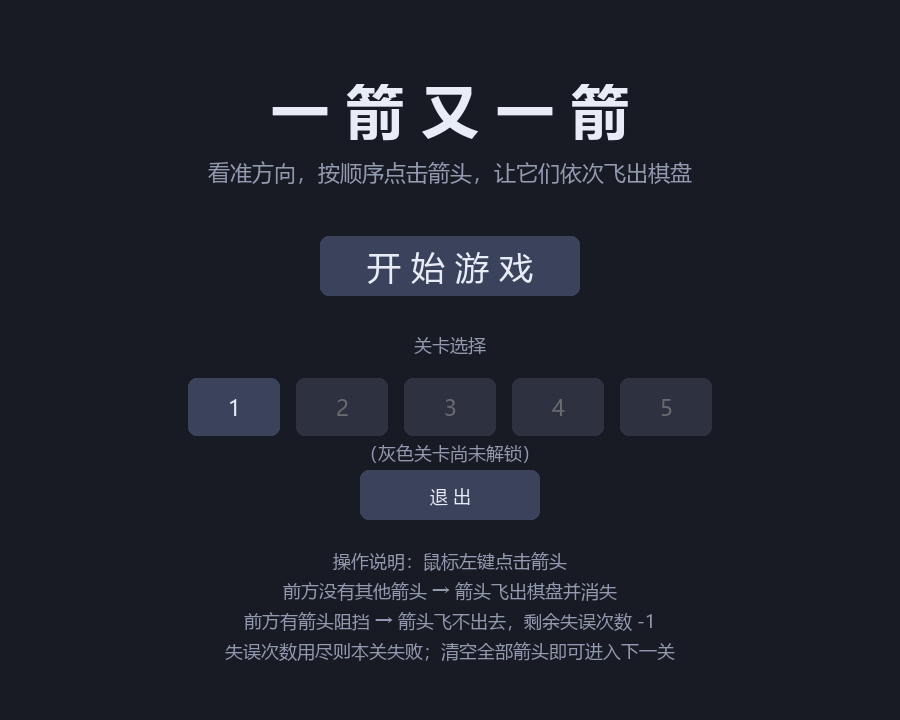
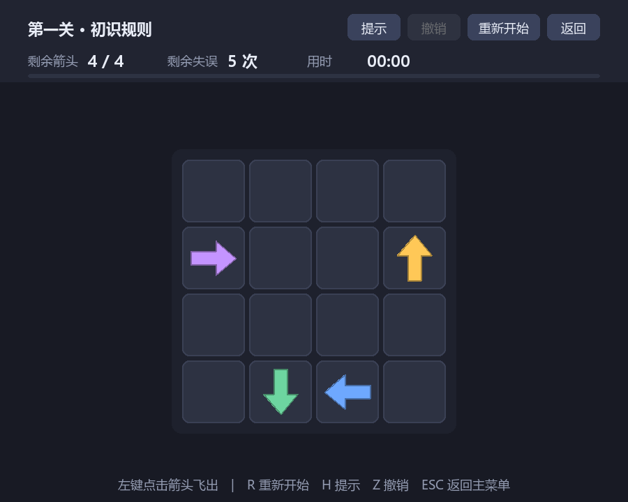
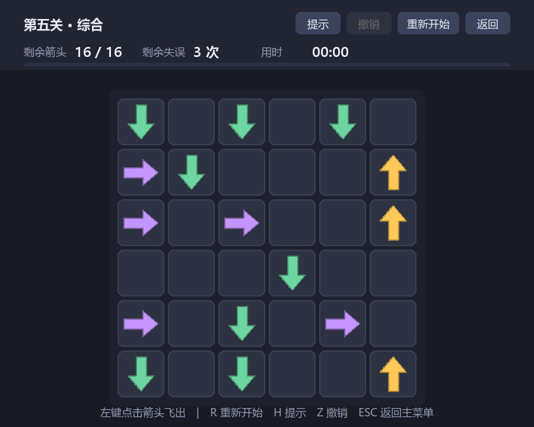
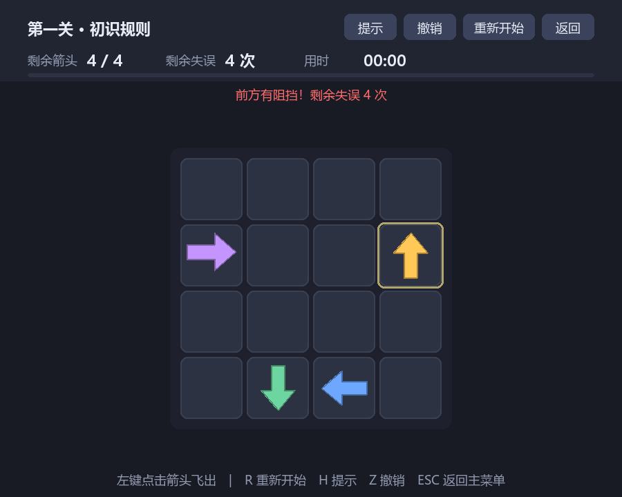
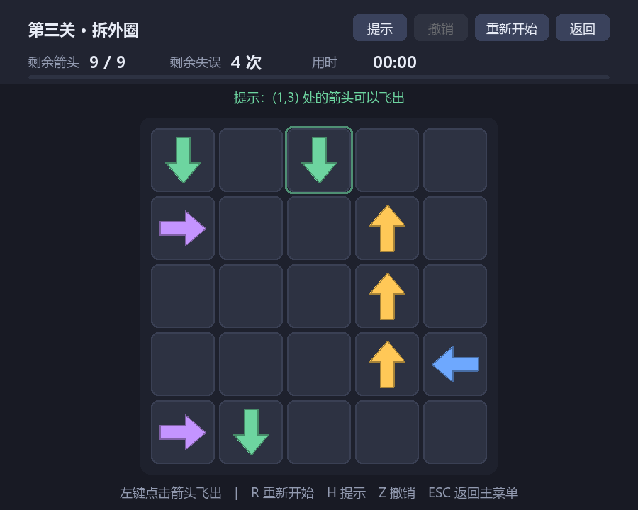
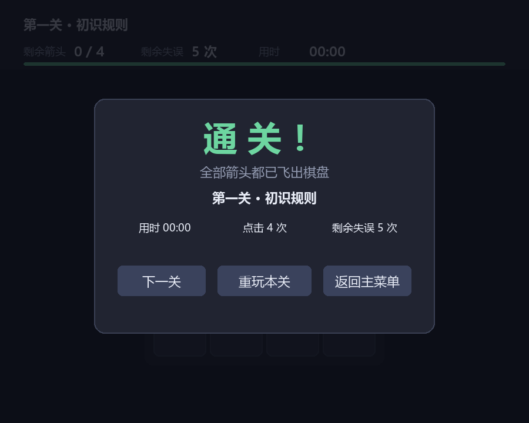
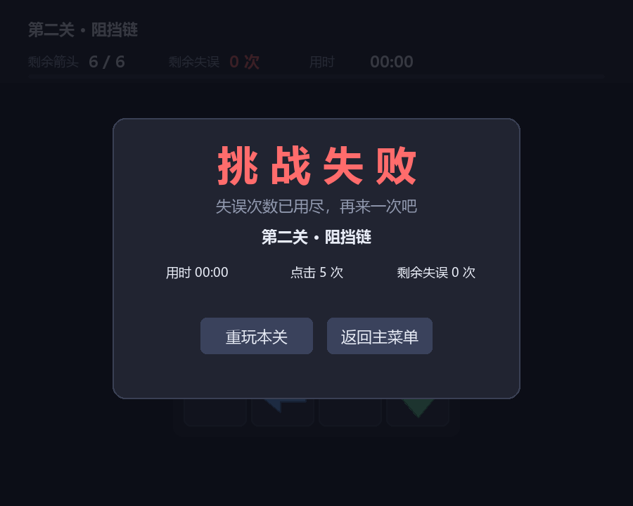

# 一箭又一箭

一个用 Python + Pygame 实现的点击式箭头解谜小游戏。玩家观察箭头的朝向和相互阻挡关系，
按合适的顺序点击箭头，让它们全部飞出棋盘。

> 本项目是《软件工程》课程第二次个人作业。开发过程中使用 Claude Code 辅助完成，
> 详细的协作过程记录见 [docs/blog.md](docs/blog.md)。

---

## 游戏简介

棋盘上散布着朝上、下、左、右四个方向的箭头。点击一个箭头时，程序检查它前进方向上
到棋盘边界之间还有没有别的箭头：

- **前方畅通** → 箭头沿自身方向飞出棋盘并消失；
- **前方有阻挡** → 箭头飞不出去并抖动变红，同时高亮挡住它的那个箭头；
- 点击被阻挡的箭头会**消耗一次失误机会**；
- 清空本关全部箭头即通关，失误次数用尽则本关失败。

一条重要的规律是：**消除箭头只会让棋盘更空，绝不会把别的箭头从「能飞」变回「被挡」。**
也就是说，只要存在通关顺序，那么「每次随便挑一个当前能飞的箭头点掉」这种不看全局的
做法就一定能通关。这一点在本项目里不只是玩法的性质，还被用来做关卡校验，详见下文。

---

## 游戏截图

| 开始界面 | 游戏界面（第一关） |
| :---: | :---: |
|  |  |

| 游戏界面（第五关，6×6） | 碰撞反馈 |
| :---: | :---: |
|  |  |

| 提示功能 | 通关界面 | 失败界面 |
| :---: | :---: | :---: |
|  |  |  |

> 截图由 `python tools/capture_screenshots.py` 自动渲染生成，改过界面后重跑该脚本即可更新。

---

## 开发环境

| 项目 | 版本 |
| --- | --- |
| 操作系统 | Windows 11 |
| Python | 3.12.5 |
| Pygame | 2.6.1 |
| 测试框架 | 标准库 `unittest`（无需额外安装） |

游戏本身只依赖 Pygame 一个第三方库。运行测试和关卡校验器不需要任何额外依赖。

---

## 安装与运行

### 1. 获取代码

```bash
git clone <仓库地址>
cd arrow-arrow
```

### 2. 安装依赖

```bash
python -m pip install -r requirements.txt
```

> Windows 上如果 `pip` 不在 PATH 里，请使用 `python -m pip` 的形式。

### 3. 启动游戏

```bash
python main.py
```

程序启动后会直接进入开始界面，点击「开始游戏」即可。

### 4. 运行测试（可选）

```bash
python -m unittest discover -s tests -v
```

共 72 个用例，覆盖棋盘规则、关卡数据与完整游戏流程。

### 5. 校验关卡（可选）

```bash
python tools/validate_levels.py
```

检查每一关是否真的能通关。改动关卡数据后建议跑一次。

---

## 游戏操作说明

### 鼠标

| 操作 | 效果 |
| --- | --- |
| 点击开始界面的关卡数字 | 直接进入已解锁的关卡 |
| 点击棋盘上的箭头 | 尝试让该箭头飞出；被挡住则消耗一次失误 |
| 点击「提示」 | 高亮一个当前可以飞出的箭头，连点可依次查看 |
| 点击「撤销」 | 退回上一步（箭头与失误次数一起回退） |
| 点击「重新开始」 | 本关恢复到初始状态 |
| 点击「返回」 | 回到主菜单 |

### 键盘快捷键

| 按键 | 效果 |
| --- | --- |
| `R` | 重新开始本关 |
| `H` | 提示 |
| `Z` | 撤销 |
| `Esc` | 返回主菜单 |
| `Enter` | 在开始界面直接开始游戏 |

### 关卡

共 5 关，规模与难度递增。每关的失误上限不同，越往后的关卡容错越小。

| 关卡 | 棋盘 | 箭头数 | 失误上限 | 设计意图 |
| --- | --- | --- | --- | --- |
| 第一关 · 初识规则 | 4×4 | 4 | 5 | 教学关，一眼能看懂规则 |
| 第二关 · 阻挡链 | 4×4 | 6 | 5 | 出现同向箭头组成的阻挡链 |
| 第三关 · 拆外圈 | 5×5 | 9 | 4 | 需要先拆掉中间一列才能放出两侧 |
| 第四关 · 长距离阻挡 | 5×5 | 12 | 4 | 阻挡跨越多个空格，要顺着整行整列看 |
| 第五关 · 综合 | 6×6 | 16 | 3 | 大棋盘，三层同向链，容错低 |

第一关通关后会解锁第二关，以此类推。

---

## 项目结构

```
arrow-arrow/
├── main.py                      程序入口
├── requirements.txt             依赖清单
├── game/
│   ├── config.py                尺寸、配色、字体、动画时长等常量
│   ├── board.py                 棋盘与箭头数据模型、路径检测（纯逻辑）
│   ├── levels.py                关卡数据（字符画形式）
│   ├── anim.py                  飞出、碰撞抖动、高亮、提示条
│   ├── ui.py                    中文字体加载、箭头绘制、按钮
│   └── scenes.py                开始 / 游戏 / 结果三个场景
├── tests/
│   ├── test_board.py            T01~T06 及边界用例
│   ├── test_levels.py           关卡可通关性等断言
│   └── test_integration.py      无头驱动的完整流程测试
├── tools/
│   ├── validate_levels.py       关卡校验器
│   └── capture_screenshots.py   批量渲染界面截图
├── screenshots/                 README 用的界面截图
└── docs/blog.md                 开发过程记录（作业博客）
```

`game/board.py` 是刻意写成**不依赖 Pygame** 的：规则判定与图形渲染完全分离，
因此全部核心逻辑都能在没有显示器的环境下直接跑单元测试。

---

## 实现要点

### 路径检测

箭头存放在 `dict[(row, col)] -> Arrow` 里，路径检测用一段统一的循环推进：

```python
def path(self, arrow):
    drow, dcol = arrow.direction.delta
    row, col = arrow.row + drow, arrow.col + dcol
    while 0 <= row < self.rows and 0 <= col < self.cols:
        yield (row, col)
        row += drow
        col += dcol
```

四个方向共用同一段代码（方向只是增量 `(drow, dcol)` 不同），
而且**循环条件本身就是边界检查** —— 一旦走出棋盘就停下，
所以调用方拿到的坐标永远合法，不存在「向上判断时数组越界」或
「负下标被 Python 当成倒数索引」这类问题。

### 关卡的可通关性是可以机械验证的

因为消除箭头只会减少棋盘占用，「当前可飞出的箭头集合」是单调递增的，于是：

- 若存在通关顺序，则贪心策略（反复消除任意一个当前可飞出的箭头）一定能清空棋盘；
- 若贪心中途卡住（还剩箭头但一个都飞不出去），该关必定**无解**。

所以关卡不需要靠人工试玩穷举就能验证。`tools/validate_levels.py` 除此之外还会
专门检出「互相阻挡的箭头对」—— 两个箭头正面相对时，放走 A 必须先移走 B，
移走 B 又必须先放走 A，是死循环。这类布局用肉眼检查字符画时很容易漏掉，
本项目在开发过程中就被它抓出过两处。

### 动画与逻辑解耦

点击时棋盘状态**立刻**更新，飞出动画只是一个与棋盘无关的视觉残影。
好处是输入永远不需要等待动画播完，玩家可以连着快速点击，
也不会出现「上一次动画还没结束就点下一发」的竞态。

### 中文字体

Pygame 的默认字体不含中文字形，直接渲染中文会得到一排方块。
`game/ui.py` 会按 `msyh.ttc → simhei.ttf → simsun.ttc` 的顺序查找系统字体，
找不到再退回 `SysFont`，避免换一台机器就全是豆腐块。

---

## 测试

运行 `python -m unittest discover -s tests -v`，共 72 个用例：

| 编号 | 测试内容 | 结果 |
| --- | --- | --- |
| T01 | 点击前方无阻挡的箭头 | 通过 |
| T02 | 点击前方有阻挡的箭头 | 通过 |
| T03 | 点击位于边缘且朝向棋盘外的箭头 | 通过 |
| T04 | 消除本关全部箭头 | 通过 |
| T05 | 失误次数耗尽 | 通过 |
| T06 | 游戏进行中重新开始 | 通过 |

除上表外，还覆盖了点击空格、点击越界坐标、点击已飞出的格子、
失误归零后继续点击、非法关卡参数等边界情况，以及完整的
「开始 → 通关 → 解锁下一关 → 失败 → 重玩」流程。

---

## 已知限制

- 游戏进度只保存在内存中，关掉程序后已解锁的关卡和记录不会保留。
- 关卡是手工设计的固定布局，没有随机关卡生成功能。
- 没有音效。

---

## 第三方资源

除 Pygame 外没有使用任何第三方代码、美术素材或音效。
界面中的箭头、按钮、图标全部由 Pygame 的绘图接口现场绘制，没有外部图片文件。
中文字体使用 Windows 系统自带的微软雅黑 / 黑体。
